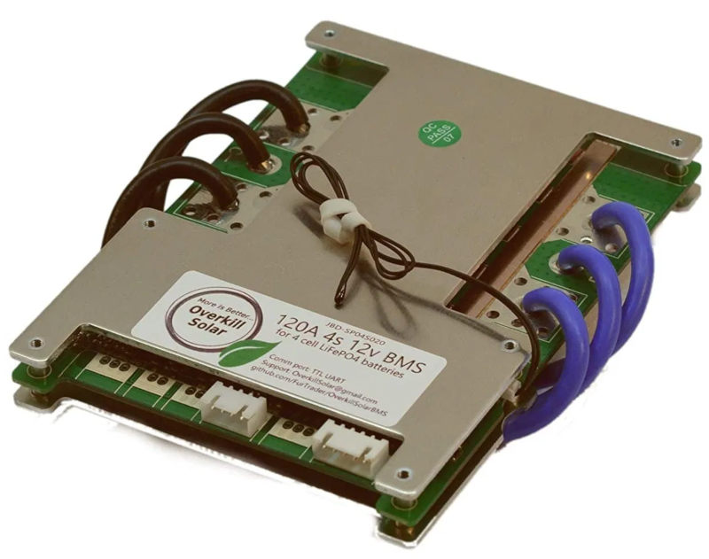

Overkill Solar BMS Monitor Library
==================================

Introduction
------------

This library communicates with an Overkill Solar BMS (Battery Monitoring
System), which can be purchased from https://overkillsolar.com/

If you'd like to purchase an Overkill Solar battery monitoring system, use this
link:

This library is capable of returning the following information:

- Total voltage, in volts
- Current in amps
- Balance capacity in amp-hours
- Rate capacity in amp-hours
- Cycle count
- Production date:
- Balance status of each cell
- Software version
- Remaining state of charge, 0-100 percent
- Charge FET on/off status
- Discharge FET on/off status
- # of batteries in series (int)
- # of NTCS [the number of temperature sensors present] (int)
- Temperatures of each temperature sensor, in Celsius (up to 16 floats)
- Voltages of each cell, in volts
- Protection status flags:

    - Software lock MOS
    - Front-end detection IC error
    - Short circuit protection
    - Discharge overcurrent protection
    - Charging overcurrent protection
    - Discharge low-temperature protection
    - Discharge over-temperature protection
    - Charging low temperature protection
    - Charging over-temperature protection
    - Whole pack undervoltage protection
    - Whole pack overvoltage protection
    - Single cell undervoltage protection
    - Single cell overvoltage protection

Library Sponsor and Open Source Commitment
------------------------------------------

Overkill Solar supports the open-source community, and by clicking on the link
above, you will be supporting the developer who wrote this library.

- https://overkillsolar.com/?myboi=NeilJansen

"Bare Metal" Disclaimer
=======================

By using this library, you accept the small but quantifiable risk that 
you may damage or destroy the BMS or batteries if precautions are not followed.
We've tested this library and have taken precautions to ensure that it works
as it is expected to, but we cannot test all possible configurations, and
cannot give any guarantees once it is modified or used on an untested
platform.

If you're an experienced embedded software developer, then the usage of this
libray should be extremely straightforward.  We've followed standard
Arduino library standards of practice.

If not, then please heed the following advice:  

- Realize that while the Arduino platform is one of the easiest platforms to
  learn embedded computing on, you're still moving ones and zeros around
  on bare metal (https://en.wikipedia.org/wiki/Bare_machine).  This means that
  small changes may have a large (and potentially disastrous) effect.  Unlike
  a laptop, PC, or mobile device, memory locations are not protected and
  therefore, it is easy to shoot yourself in the foot if you are not careful.
  Our advice to you, dear reader, is to practice your Arduino mastery on a
  small sensor or display first, before graduating into something of this
  magnitude.
- Read the introduction (https://www.arduino.cc/en/Guide/Introduction) 
  if you are new to the Arduino platform.
- Read the documentation on installing Arduino libraries
  (https://www.arduino.cc/en/Guide/Libraries) and writing libraries
  (https://www.arduino.cc/en/Hacking/LibraryTutorial) if you are new to usiung,
  writing, or modifying libraries on the Arduino platform.
- This library was written for the Arduino AVR platform.  Other platforms
  may work, but are not supported at this time.  Specifically, the libray has
  been tested to work with the Arduino Pro Micro and Arduino Mega 2560.
- Solar battery systems can produce tremendous energy, and can be dangerous
  if proper precautions are not followed.  A complete course in electrical
  theory of operation is of-of-scope for this document.

Theory of Operation
===================

This library was written to conform with the serial protocol published here:
https://github.com/FurTrader/OverkillSolarBMS/blob/master/JBD%20Protocol%20English%20version.pdf
The protocol is Modbus-like, in that it's a binary protocol that sends and
receives frames that consist of a fixed start byte, an address register,
variable-length data, a checksum, and a fixed stop byte.

The Arduino communicates with the BMS over a 5V TTL asynchronous serial port
connection, at 9600 baud, 8 data bits, no parity, and 1 stop bit. 

The library is intended to be used in a similar manner to typical Arduino
libraries.  The constructor call is typically placed near the top of the
sketch.  The library is initialized within the sketch's ``setup()``
function.  And in order for it to read and write to the serial port, the
``bms.main_task()`` function must be called repeatedtly in the sketch's
``loop()`` function.  Typically, the sketch will need to do other things
while the serial port task is running.  For example, writing the received
data to the screen, or reading buttons or encoders.  The Arduino is not
multi-threaded, and cannot run things simultaneously.  However, as long as
each task is very short (on the order of microseconds or milliseconds),
the tasks can take turns carrying out their role.  The BMS library's main task
handles all of the reading and writing on the BMS serial port.  It needs
to be called at least once every 25 milliseconds (it may be called faster).
This means that the other tasks being performed should not take longer
than 25 milliseconds to execute.  Even a single ``delay(1000);`` call
would block access to the serial port.  If this strategy isn't desirable,
then it's possible to setup a periodic hardware timer to call an interrupt,
and have the interrupt call the ``bms.main_task()`` function.  This may
have other side-effects, so only use this as a last resort.

The library periodically requests basic info and cell voltage from the BMS
at a default rate of 1000 milliseconds. This periodic rate may be configured
to any value, although values under 250 milliseconds are not recommended.

Response data is received from the BMS in the ``bms.serial_rx_task()`` method.
Whenever this method is called, it will read all available bytes from the
serial port and sequentially pass them to the framer.  The framer's job is
to reconstruct each frame.  It will begin by waiting for a start byte, then
the command code (register address), then the status byte, the length byte,
the data, two checksum bytes, and finally the stop byte.  The internal
state of the framer is stored in memory, so in some cases, the
``bms.serial_rx_task()`` may need to be called several times before a full frame
is received.  

Once a frame is received, it is checked for validity.  If the checksum passes,
and the status by indicates that is correct, the data is stored internally.
This data is stored in a raw state that's much more memory efficient than its
full decoded form.  When the data is requested, the encoded form is converted
to the full form and returned.  For example, the voltage is stored in 2 bytes
of memory, but when requested, it gets converted to a floating-point number
which is 4 bytes.

The polling rate of the data being requested from the BMS can be changed,
using the ``bms.set_query_rate()`` method.  Simply provide it with an integer
period time, in miliseconds.  There is an example in the section below.

If the BMS is not responding, then the method ``bms.get_comm_error_state()``
will return true.  If it is responding and outputing valid data, it will
return false.

Library Usage
=============

Compile-time Options
--------------------

Because SRAM on the Arduino AVR is scarce, certain parameters may be enabled or
disabled before compiling to save memory.  If you would like to conserve
memory in your sketch, find the following lines in the bms.h file, and
comment the lines out by placing two forward slashes at the beginning of the
line.  Most of these things are not needed.

.. code:: C

    #define BMS_OPTION_PRODUCTION_DATE  // Comment this out if reading the production date is not needed.
    #define BMS_OPTION_SW_VERSION       // Comment this out if reading the software version is not needed.
    #define BMS_OPTION_NAME             // Comment this out if reading the BMS name is not needed.
    #define BMS_OPTION_FAULT_COUNTS     // Comment this out to not store the number of times a fault occurred.
    //#define BMS_OPTION_DEBUG                // Uncomment this to output debug logging data on the Serial monitor port.
    //#define BMS_OPTION_DEBUG_STATE_MACHINE  // Uncomment this to output debug the state machine

Sketch Structure
----------------

Towards the top of your sketch, include the libray and call the constructor:

.. code:: C

    #include "bms.h"

    OverkillSolarBms bms = OverkillSolarBms();

Ensure that your sketch's setup() function looks something like this:

.. code:: C

    void setup() {
        delay(500);

        Serial1.begin(9600);
        while (!Serial1) {  // Wait for the BMS serial port to initialize
        }

        bms.begin(&Serial1);
    }

The Arduino will call this ``setup()`` function once, when it is booted or
rebooted.  This is typically where GPIO pins are configured, serial ports are
configured, and other things.  We cannot do that outside of the ``setup()``
function because those resources are not guaranteed to be active until the
``setup()`` method is called.  

Certain Arduinos have multiple serial ports.  The desired serial port must be
passed to the bms.begin() function, so that the library will know where to
send and receive the data.  The while loop above is recommended.  It ensures
that the serial port has fully initialized before the rest of the items are
executed.

Next, we move onto the ``loop()`` function.  The Arduino sketch will call this
function repeatedly, until it is powered down or rebooted.   We call the
``bms.main_task()`` function, which reads and writes data to the serial
port.

.. code:: C

    void loop() {
        bms.main_task();
    }

If we need to do other things periodically, like maybe blink and LED, we can
make our own task to do it.  Rather than using ``delay(1000)``, which would
block our task from running, we use the system timer and an if statement.
To blink the LED, we need to configure it in the setup() function, and we
need to declare a global variable to store the last time we toggled the state:

.. code:: C

    #include "bms.h"

    OverkillSolarBms bms = OverkillSolarBms();
    uint32_t last_update;

    void setup() {
        Serial1.begin(9600);
        while (!Serial1) {  // Wait for the BMS serial port to initialize
        }

        bms.begin(&Serial1);
        pinMode(LED_BUILTIN, OUTPUT);
    }

    void loop() {
        bms.main_task();

        // Do something at 1 millisecond
        if (millis() - last_update >= 2500) {
           digitalWrite(LED_BUILTIN, !digitalRead(LED_BUILTIN));
           last_update = millis();
        }
    }

So next, we will actually do something with the data received from the BMS.
We will also set a custom polling rate.  Pretend in this example that we only
want to read the BMS parameters every 2 seconds, to save battery power.
This application only requires us to read the capacity and turn on the LED
if it drops below 30%.

.. code:: C

    #include "bms.h"

    OverkillSolarBms bms = OverkillSolarBms();
    uint32_t last_soc_check_time;

    #define SOC_POLL_RATE 2000  // milliseconds

    void setup() {
        pinMode(LED_BUILTIN, OUTPUT);
        Serial1.begin(9600);
        while (!Serial1) {  // Wait for the BMS serial port to initialize
        }
        bms.begin(&Serial1);
        bms.set_query_rate(2000);  // Set query rate to 2000 milliseconds (2 seconds)
        last_soc_check_time = 0;
    }

    void loop() {
        bms.main_task();
        uint8_t soc = bms.get_state_of_charge();

        if (millis() - last_soc_check_time > SOC_POLL_RATE) {
            if (soc < 30) {
                digitalWrite(LED_BUILTIN, HIGH);
            }
            else {
                digitalWrite(LED_BUILTIN, LOW);
            }

            last_soc_check_time = millis();
        }

    }

Getting basic info
------------------

The most important parameters that the BMS providers are listed below.
Usage is quite straightforward.  Simply call the method(s) after the library has
requested data from the BMS.

=======================  ===========  =================================  =========  ===========================================================
Parameter                Return Type  Method name                        Units      Description
=======================  ===========  =================================  =========  ===========================================================
Voltage                  float        ``get_voltage()``                  volts      Returns the total voltage
Current                  float        ``get_current()``                  amps       Returns the instantaneous current
Balance capacity         float        ``get_balance_capacity()``         amp hours  Returns the balance capacity
Rate capacity            float        ``get_rate_capacity()``            amp hours  Returns the rate capacity
State of charge          uint8_t      ``get_state_of_charge()``          percent    Returns the state of charge (0-100)
Cycle count              uint16_t     ``get_cycle_count()``              cycles     Returns the cycle count (number of charge/discharge cycles)
Discharge MOSFET status  bool         ``get_discharge_mosfet_status()``  N/A        Returns true if the discharge FET is enabled
Charge MOSFET status     bool         ``get_charge_mosfet_status()``     N/A        Returns true if the charge FET is enabled
Number of cells          uint8_t      ``get_num_cells()``                N/A        Returns the # of cells in which the BMS is configured for
Number of temp sensors   uint8_t      ``get_num_ntcs()``                 N/A        Returns the # of temperature sensors
=======================  ===========  =================================  =========  ===========================================================

Voltage and Current example
~~~~~~~~~~~~~~~~~~~~~~~~~~~

.. code:: C

    float voltage = bms.get_voltage();
    lcd.print("Voltage: ");
    lcd.print(voltage, 3);
    lcd.println(" volts");

    float current = bms.get_current();
    lcd.print("Current:" );
    lcd.print(current, 1);
    lcd.println(" amps");

If your application requires current to be displayed in milliamps, then
simply convert by multiplying times 1000:

.. code:: C

    float current = bms.get_current();
    current *= 1000;  // Convert amps to mA
    lcd.print("Current:" );
    lcd.print(current, 0);  // Limit to zero decimal places
    lcd.println(" mA");

Capacity example
~~~~~~~~~~~~~~~~

The BMS returns two capacities: The balance capacity, and the rate capacity.
Both are returned in amp hours (Ah).

.. code:: C

    float balance_capacity = bms.get_balance_capacity();
    float rate_capacity    = bms.get_rate_capacity();

    lcd.print("Balance Capacity: ");
    lcd.print(balance_capacity, 2);
    lcd.println(" Ah");

    lcd.print("Rate Capacity: ");
    lcd.print(rate_capacity, 2);
    lcd.print(" Ah");

Power example
~~~~~~~~~~~~~

There are no API methods to return the power in Watts.  But, power can be
calculated from the current and voltage.refer to Ohm's law:

.. math::
    
    P = I * V

.. code:: C

    float power = bms.get_voltage() * bms.get_current();

    lcd.print("Power: ");
    lcd.print(power, 1);
    lcd.println(" watts");

State of Charge example
~~~~~~~~~~~~~~~~~~~~~~~

This is the fuel gauge readout for your battery.  The state of charge is
returned as a percentage (0 to 100 percent).

.. code:: C

    uint8_t soc = bms.get_state_of_charge();

    lcd.print("State of Charge: ");
    lcd.print(soc, DEC);
    lcd.println("%");

Cycle count example
~~~~~~~~~~~~~~~~~~~

The cycle count represents the number of times the battery pack has been
charged and discharged.  The result is an integer number that will increase
over time.  Note that the typical LiFePO4 battery is good for several thousand
cycles.  This is considerably more than lead-acid and Lithium Ion (e.g. NMC,
NCA, LMO, LCO) batteries.

.. code:: C

    uint16_t cycle_count = bms.get_cycle_count();

    lcd.print("This battery has been cycled ");
    lcd.print(cycle_count, DEC);
    lcd.print(" times");

Charge / Discharge status example
~~~~~~~~~~~~~~~~~~~~~~~~~~~~~~~~~

To view the status of the BMS charge and discharge MOSFET switches

.. code:: C

    bool discharge_status = bms.get_discharge_mosfet_status();
    bool charge_status    = bms.get_charge_mosfet_status();

    lcd.print("The discharge FET is ");
    lcd.println(discharge_status? "on": "off");

    lcd.print("The charge FET is ");
    lcd.println(charge_status? "on": "off");

Ensuring that the BMS data is being received
--------------------------------------------

To make sure that you're receiving data, use ``bms.get_comm_error_state()``.
It will will be true if the BMS is not responding (if the BMS has not responded
within ).  You can use this to
determine whether or not to write live data to the screen.

.. code:: C

    bool is_bms_not_responding = bms.get_comm_error_state();  

    if (is_bms_not_responding) {
        lcd.println("No data from BMS");
    }
    else {
        lcd.print("Voltage: ");
        lcd.print(bms.get_voltage());
        lcd.print(" volts");
        // etc...
    }

Getting the Protection Status
-----------------------------

The protection status is made up of thirteen status flags.  Each flag
represents whether or not a particular thing has happened within the BMS.
The status flags are returned in a single struct object.  The struct
is a container that contains thirteen booleans.

Here's a table of the flags returned:

=====================================  ====  =========================================
Parameter                              type   Variable name
=====================================  ====  =========================================
Single-cell overvoltage protection     bool  ``single_cell_overvoltage_protection``
Single-cell undervoltage protection    bool  ``single_cell_undervoltage_protection``
Whole-pack overvoltage protection      bool  ``whole_pack_overvoltage_protection``
Whole-pack undervoltage protection     bool  ``whole_pack_undervoltage_protection``
Charging over-temperature protection   bool  ``charging_over_temperature_protection``
Charging low-temperature protection    bool  ``charging_low_temperature_protection``
Discharge over-temperature protection  bool  ``discharge_over_temperature_protection``
Discharge low-temperature protection   bool  ``discharge_low_temperature_protection``
Charging overcurrent protection        bool  ``charging_overcurrent_protection``
Discharge overcurrent protection       bool  ``discharge_overcurrent_protection``
Short-circuit protection               bool  ``short_circuit_protection``
Front-end detection IC error           bool  ``front_end_detection_ic_error``
Software lock MOS                      bool  ``software_lock_mos``
=====================================  ====  =========================================

In all cases, ``true`` means that the fault is active.

Here's how to check these flags in your code:

.. code:: C

    ProtectionStatus flags = bms.get_protection_status();

    if (flags.single_cell_overvoltage_protection) {
        lcd.print("Error: Single-cell over-voltage protection has occurred!");
    }
    if (flags.single_cell_undervoltage_protection) {
        lcd.print("Error: Single-cell undervoltage protection has occurred!");
    }
    if (flags.whole_pack_overvoltage_protection) {
        lcd.print("Error: Whole-pack overvoltage protection has occurred!");
    }
    if (flags.whole_pack_undervoltage_protection) {
        lcd.print("Error: Whole-pack undervoltage protection has occurred!");
    }
    if (flags.charging_over_temperature_protection) {
        lcd.print("Error: Charging over-temperature protection has occurred!");
    }
    if (flags.charging_low_temperature_protection) {
        lcd.print("Error: Charging low-temperature protection has occurred!");
    }
    if (flags.discharge_over_temperature_protection) {
        lcd.print("Error: Discharge over-temperature protection has occurred!");
    }
    if (flags.discharge_low_temperature_protection) {
        lcd.print("Error: Discharge low-temperature protection has occurred!");
    }
    if (flags.charging_overcurrent_protection) {
        lcd.print("Error: Charging overcurrent protection has occurred!");
    }
    if (flags.discharge_overcurrent_protection) {
        lcd.print("Error: Discharge overcurrent protection has occurred!");
    }
    if (flags.short_circuit_protection) {
        lcd.print("Error: Short-circuit protection has occurred!");
    }
    if (flags.front_end_detection_ic_error) {
        lcd.print("Error: Front-end detection IC error has occurred!");
    }
    if (flags.software_lock_mos) {
        lcd.print("Error: Software lock MOS has occurred!");
    }

If you just want to see whether or not *any* error flag has been asserted,
you can use this function:

.. code:: C

    bool has_something_gone_wrong = bms.get_protection_status_summary();  
    // Returns True if any protection status bits are currently active

    if (has_something_gone_wrong) {
        lcd.println("oh dear");
    }

Getting the voltage and balance status for each cell
----------------------------------------------------

Cell voltages can be requested as follows.  The ``bms.get_cell_voltage()``
method must be passed the index of the cell to read.  Indexes start at zero
and count up.

.. code:: C

    // Get temperature sensor #1:
    float cell_1 = bms.get_cell_voltage(0);

    // Get temperature sensor #2:
    float cell_2 = bms.get_cell_voltage(1);

    // Print out all cell voltages:
    for (uint8_t i=0; i<bms.get_num_cells(); i++) {
        // Print each voltage with 3 decimal places
        lcd.println(bms.get_cell_voltage(i, 3));  
    }

Balance status can be requested as well.  The balance status is whether or not
a particular cell in the pack is being balanced.  The ``bms.get_balance_status()``
method must be passed the index of the cell.  Indexes start at zero and count
up.

.. code:: C

    bool cell_1_status = bms.get_balance_status(0);  
    bool cell_2_status = bms.get_balance_status(1);  
    bool cell_3_status = bms.get_balance_status(2);  
    bool cell_4_status = bms.get_balance_status(3);  

    lcd.print("Cell 1 is ");
    lcd.println(cell_1_status? "balancing" : "not balancing");
    lcd.print("Cell 2 is ");
    lcd.println(cell_2_status? "balancing" : "not balancing");
    lcd.print("Cell 3 is ");
    lcd.println(cell_3_status? "balancing" : "not balancing");
    lcd.print("Cell 4 is ");
    lcd.println(cell_4_status? "balancing" : "not balancing");

    // Or, here's the same thing in a for loop, which will handle any number of cells:
    for (uint8_t i; i < bms.get_num_cells(); i++) {
        lcd.print("Cell ");
        lcd.print(i + 1);
        lcd.print("is ");
        lcd.println(bms.get_balance_status(i)? "balancing" : "not balancing");
    }

Getting the temperatures
------------------------

Temperatures can be requested as follows:

.. code:: C

    // Get temperature sensor #1:
    float temp_batt = bms.get_ntc_temperature(0);

    // Get temperature sensor #2:
    float temp_internal = bms.get_ntc_temperature(1);

    // Print out all temperatures:
    for (uint8_t i=0; i<bms.get_num_ntcs(); i++) {
        // Print each temp with 2 decimal places
        lcd.println(bms.get_ntc_temperature(i, 2));  
    }

Temperatures are always return in Celsius.

Controlling the FETs
--------------------

The BMS has two software-controllable MOSFETs:

1. The discharge FET.  When disabled, the BMS will not allow the battery to discharge
2. The charge FET.  When disabled, the BMS will not charge the battery

You can control them by writing boolean values to this function:

.. code:: C

    bool charge = true;
    bool discharge = false;
    bms.set_mosfet_control(charge, discharge);

    bms.set_mosfet_control(true, true);  // Turn both on
    bms.set_mosfet_control(false, false);  // Turn both off

Note that you can read the status of these MOSFETS (we discussed these earlier):

.. code:: C

    lcd.print("The discharge FET is ");
    lcd.println(bms.get_discharge_mosfet_status()? "on": "off");

    lcd.print("The charge FET is ");
    lcd.println(bms.get_charge_mosfet_status()? "on": "off");

Getting the Production Date
---------------------------

First, make sure the line below is un-commented, in the options.h file:

.. code:: C

    #define BMS_OPTION_PRODUCTION_DATE

The date is returned as a ``ProductionDate`` struct object.  It is a container
of three integers: Day, month, and year.  They're access with the dot
notation, shown below:

.. code:: C

    ProductionDate date = bms.get_production_date();
    lcd.println(date.day);
    lcd.println(date.month);
    lcd.println(date.year);

Getting BMS Fault Counts
------------------------

Note that in the current version of this library, fault counts are not saved.
So rebooting or resetting the sketch will result in the fault counts being
cleared to zero.

First, make sure the line below is un-commented, in the options.h file:

.. code:: C

    #define BMS_OPTION_FAULT_COUNTS

To read the fault counts:

.. code:: C

    FaultCount fault_counts = bms.get_fault_counts();

    if (fault_counts.single_cell_overvoltage_protection) {
        lcd.println("");
    }
    fault_counts.single_cell_undervoltage_protection
    fault_counts.whole_pack_overvoltage_protection
    fault_counts.whole_pack_undervoltage_protection
    fault_counts.charging_over_temperature_protection
    fault_counts.charging_low_temperature_protection
    fault_counts.discharge_over_temperature_protection
    fault_counts.discharge_low_temperature_protection
    fault_counts.charging_overcurrent_protection
    fault_counts.discharge_overcurrent_protection
    fault_counts.short_circuit_protection
    fault_counts.front_end_detection_ic_error
    fault_counts.software_lock_mos

Fault counts can be reset to zero:

.. code:: C

    bms.clear_fault_counts();

Getting the BMS Software Version
--------------------------------

First, make sure the line below is un-commented, in the options.h file:

.. code:: C

    #define BMS_OPTION_SW_VERSION

The software version is returned as a struct object.  It's a container of
two intergers: Major and minor.  We create a struct object of type
SoftwareVersion to store it in.  Then the major and minor 

.. code:: C

    SoftwareVersion sw_version bms.get_software_version();
    lcd.print("Software Version: ");
    lcd.print(sw_version.major, DEC);
    lcd.print('.');
    lcd.println(sw_version.minor, DEC);

Getting the BMS Name
--------------------

First, make sure the line below is un-commented, in the options.h file:

.. code:: C

    #define BMS_OPTION_NAME

The BMS name is returned as a string.

.. code:: C

    String name = bms.get_bms_name();
    lcd.print("BMS Name: ");
    lcd.println(name);

Debugging and Status
--------------------

First, make sure the line below is un-commented, in the options.h file:

.. code:: C

    #define BMS_OPTION_DEBUG

You can print out all of the BMS data to the monitor serial port.  Just make
sure that some BMS data has been received and processed before calling it.

.. code:: C

    debug();

If you're debugging protocol or communication errors, you can view the number
of RX framing errors that have occured:

.. code:: C

    uint8_t num_rx_errors = bms.get_rx_errors();  // Returns the # of RX errors that have occured while trying to 
    if (num_rx_errors > 0) {
        Serial.println("We got ");
        Serial.print(num_rx_errors, DEC);
        Serial.print(" RX framing errors!");
    }

Contributing
============

Send suggestions and bugs to OverkillSolar@gmail.com 

Copyright & License
===================

Copyright 2020 Neil Jansen (njansen1@gmail.com)

Redistribution and use in source and binary forms, with or without
modification, are permitted provided that the following conditions are met:

1. Redistributions of source code must retain the above copyright notice,
   this list of conditions and the following disclaimer.

2. Redistributions in binary form must reproduce the above copyright notice,
   this list of conditions and the following disclaimer in the documentation
   and/or other materials provided with the distribution.

3. Neither the name of the copyright holder nor the names of its contributors
   may be used to endorse or promote products derived from this software
   without specific prior written permission.

THIS SOFTWARE IS PROVIDED BY THE COPYRIGHT HOLDERS AND CONTRIBUTORS "AS IS"
AND ANY EXPRESS OR IMPLIED WARRANTIES, INCLUDING, BUT NOT LIMITED TO, THE
IMPLIED WARRANTIES OF MERCHANTABILITY AND FITNESS FOR A PARTICULAR PURPOSE
ARE DISCLAIMED. IN NO EVENT SHALL THE COPYRIGHT HOLDER OR CONTRIBUTORS BE
LIABLE FOR ANY DIRECT, INDIRECT, INCIDENTAL, SPECIAL, EXEMPLARY, OR
CONSEQUENTIAL DAMAGES (INCLUDING, BUT NOT LIMITED TO, PROCUREMENT OF
SUBSTITUTE GOODS OR SERVICES; LOSS OF USE, DATA, OR PROFITS; OR BUSINESS
INTERRUPTION) HOWEVER CAUSED AND ON ANY THEORY OF LIABILITY, WHETHER IN
CONTRACT, STRICT LIABILITY, OR TORT (INCLUDING NEGLIGENCE OR OTHERWISE)
ARISING IN ANY WAY OUT OF THE USE OF THIS SOFTWARE, EVEN IF ADVISED OF THE
POSSIBILITY OF SUCH DAMAGE.
